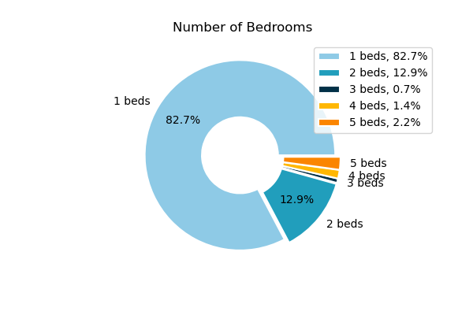
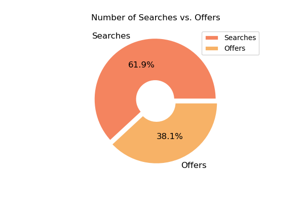
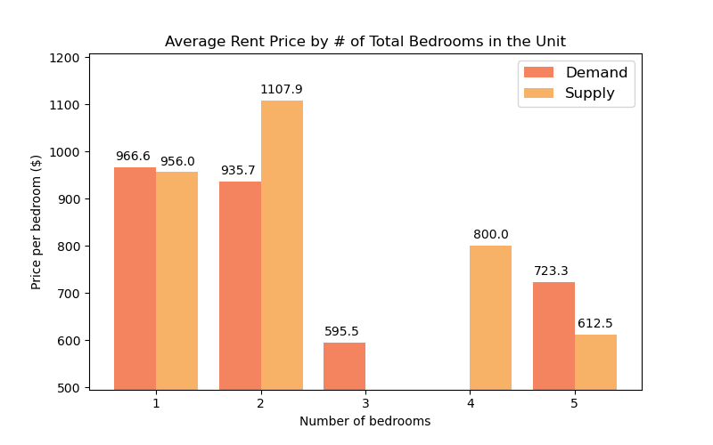

# Waterloo Student Housing Analysis: Project Overview

## Resources Used 
**Python Version:** 3.9.12    
**Packages:** BeautifulSoup, Selenium, Pandas, Matplotlib, Numpy

## Web Scraping
Scraped 250+ recent posts from the Facebook page [Student Housing in Waterloo](https://www.facebook.com/groups/110354088989367). With each posting, I got the following:
*	Rent Price
*	Number of bedrooms
*	A boolean value that indicates whether the user is offering **or** looking for a place

## Data Cleaning
* Parsed numeric data out of rent prices
* Parsed text from each posting and identified the number of bedrooms being offered
* Removed rows without price **or** number of bedrooms
* Removed rows with extraordinary values (e.g, price < 300, bedrooms > 10, etc.)
* Formatted data into a Pandas readable format
* Parsed text from each posting and looked for keywords to identify whether the author is offering, **or** searching for a place

## Data Analysis and Visualization
I looked at the distributions of the data and difference in the average rent price depending on the number of total bedrooms. Below are a few highlights.

